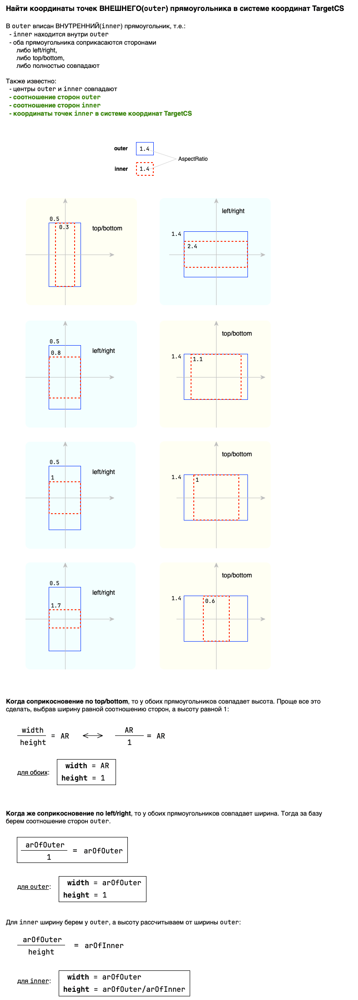

# Алгоритмы

## `getOuterRectOnTargetCS`

# Линейная алгебра

### Реализация [конвертера пропорций и углов](https://rm.mapmakers.ru/projects/gis-meteo-online/wiki/%D0%9A%D0%BE%D0%BD%D0%B2%D0%B5%D1%80%D1%82%D0%B5%D1%80_%D0%BF%D1%80%D0%BE%D0%BF%D0%BE%D1%80%D1%86%D0%B8%D0%B9_%D0%B8_%D1%83%D0%B3%D0%BB%D0%BE%D0%B2):

[src/linear-algebra/operator.ts](https://gitlab.mapmakers.ru/web/gm/math/-/blob/master/src/linear-algebra/operator.ts)  
функция  
`proportionsWithRotationConverter`

### Реализация [конвертера пропорций](https://rm.mapmakers.ru/projects/gis-meteo-online/wiki/%D0%9A%D0%BE%D0%BD%D0%B2%D0%B5%D1%80%D1%82%D0%B5%D1%80_%D0%BF%D1%80%D0%BE%D0%BF%D0%BE%D1%80%D1%86%D0%B8%D0%B9):

[src/linear-algebra/operator.ts](https://gitlab.mapmakers.ru/web/gm/math/-/blob/master/src/linear-algebra/operator.ts)  
функция  
`proportionsConverter`
